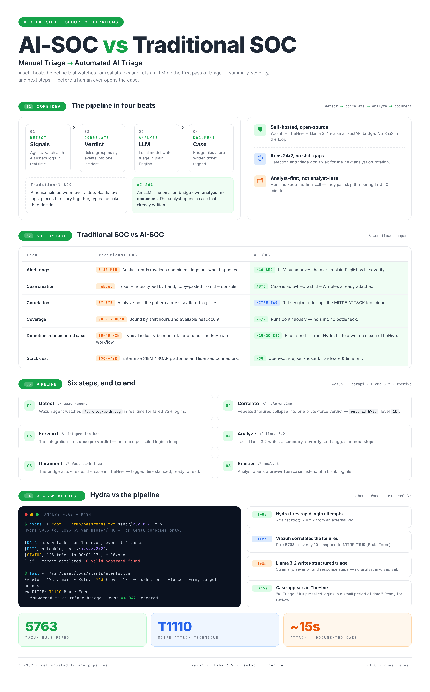

# AI-SOC Lab

**A self-hosted, AI-augmented Security Operations Center that detects, correlates, analyzes, and documents real attacks — with zero human intervention in the first pass of triage.**



🎥 **[Watch the demo](https://www.linkedin.com/feed/update/urn:li:activity:7480883113728942080/)** — a real SSH brute-force attack, from first login attempt to a fully documented, MITRE-mapped case in TheHive, in ~15 seconds.

---

## What this is

A traditional SOC analyst reads a raw log, decides what it means, and writes it up. This project automates that first pass: **Wazuh** detects and correlates the event, a locally-hosted **LLM (Llama 3.2 via Ollama)** analyzes it and writes a triage summary, and a custom **FastAPI bridge** automatically files the result as a case in **TheHive**. By the time a human looks at it, the case is already written.

## Architecture

```
 Attacker            Monitored Host              AI Layer                Case Mgmt
┌──────────┐      ┌──────────────────┐      ┌──────────────┐      ┌──────────────────┐
│  Hydra   │─SSH─▶│  Wazuh Agent     │      │              │      │                  │
│ (attack) │      │  → auth.log      │      │              │      │                  │
└──────────┘      │  Wazuh Manager   │─────▶│  FastAPI     │─────▶│  TheHive         │
                   │  (correlation,   │ POST │  Bridge      │ POST │  (case created)  │
                   │  rule 5763,      │      │              │      │       │          │
                   │  MITRE T1110)    │      │  ↓           │      │       ▼          │
                   └──────────────────┘      │  Ollama      │      │  Cortex          │
                                              │  (Llama 3.2) │      │  (enrichment)    │
                                              └──────────────┘      └──────────────────┘
                                                                            │
                                                                            ▼
                                                                     MISP (threat intel)
```

**Six-stage pipeline:**

| # | Stage | Component | What happens |
|---|-------|-----------|---------------|
| 1 | Detect | Wazuh Agent | Watches `/var/log/auth.log` in real time |
| 2 | Correlate | Wazuh Manager | Groups repeated failures into one verdict (rule `5763`, level `10`, MITRE `T1110`) |
| 3 | Forward | Wazuh Integration | Fires a webhook once per verdict — not per failed attempt |
| 4 | Analyze | Ollama + Llama 3.2 | Generates summary, severity, and recommended response |
| 5 | Document | FastAPI Bridge | Auto-creates a tagged, timestamped case via TheHive's API |
| 6 | Review | TheHive | Analyst opens a pre-written case, not a blank log file |

## Tech stack

- **[Wazuh](https://wazuh.com/)** — SIEM / endpoint monitoring
- **[TheHive](https://thehive-project.org/)** — case management
- **[Cortex](https://github.com/TheHive-Project/Cortex)** — observable enrichment engine
- **[MISP](https://www.misp-project.org/)** — threat intelligence platform
- **[Ollama](https://ollama.com/)** running **Llama 3.2 3B** — local, self-hosted LLM
- **FastAPI** — the automation bridge tying it all together
- **Docker Compose** — deployment
- **Google Cloud Platform** — infrastructure (see note below)

## Why it's on a cloud VM, not localhost

I originally intended to run this stack locally, but my laptop had 4GB of usable RAM (a failed memory stick) and a struggling SSD — nowhere near the ~32GB most of these tools recommend combined. Rather than skip the project, I moved the full stack to a free-tier Google Cloud VM and used my laptop purely as a client/attacker machine. Full writeup: [`docs/PROBLEMS-SOLVED.md`](docs/PROBLEMS-SOLVED.md).

## Real-world test

```bash
$ hydra -l root -P /tmp/passwords.txt ssh://<TARGET_IP> -t 4
[DATA] attacking ssh://<TARGET_IP>:22/
1 of 1 target completed, 0 valid password found
```

| Time | Event |
|------|-------|
| T+0s | Hydra fires rapid login attempts against `root@<TARGET_IP>` from an external VM |
| T+2s | Wazuh correlates the failures under rule `5763` — brute-force detected, severity `10`, MITRE `T1110` |
| T+8s | Llama 3.2 reads the alert and writes a structured triage: summary, severity, response steps |
| T+15s | Case appears in TheHive: *"AI-Triage: Multiple failed logins in a small period of time"* — fully written, no analyst involved yet |

## Repository contents

- [`docker-compose/`](docker-compose/) — sanitized deployment configs for Wazuh, TheHive+Cortex, and MISP
- [`ai-bridge/main.py`](ai-bridge/main.py) — the FastAPI service that connects Wazuh → Ollama → TheHive
- [`docs/PROBLEMS-SOLVED.md`](docs/PROBLEMS-SOLVED.md) — a real account of the debugging involved (disk space exhaustion, Docker networking failures, permission model issues, a MISP port-redirect bug, and more)

> **Note on live access:** this repo contains sanitized configuration only. The live infrastructure isn't publicly exposed, since it runs with test credentials not meant for public access. The demo video and infographic above show it running end to end.

## Setup (high level)

1. Provision a VM with ≥16GB RAM (this was built and tested on a 4 vCPU / 16GB GCP instance)
2. Install Docker + Docker Compose
3. Deploy each compose file in `docker-compose/`, updating placeholder IPs/passwords
4. Install and configure Ollama, pull `llama3.2:3b`
5. Deploy `ai-bridge/main.py` (see inline comments for required environment variables)
6. Add the custom integration block to Wazuh's `ossec.conf` (see comments in `docker-compose/wazuh-single-node.yml`)

## Skills demonstrated

Linux system administration · Docker & container networking · Cloud infrastructure (GCP) · REST API integration · LLM prompting for structured output · SIEM rule tuning · Systematic debugging under real failure conditions
